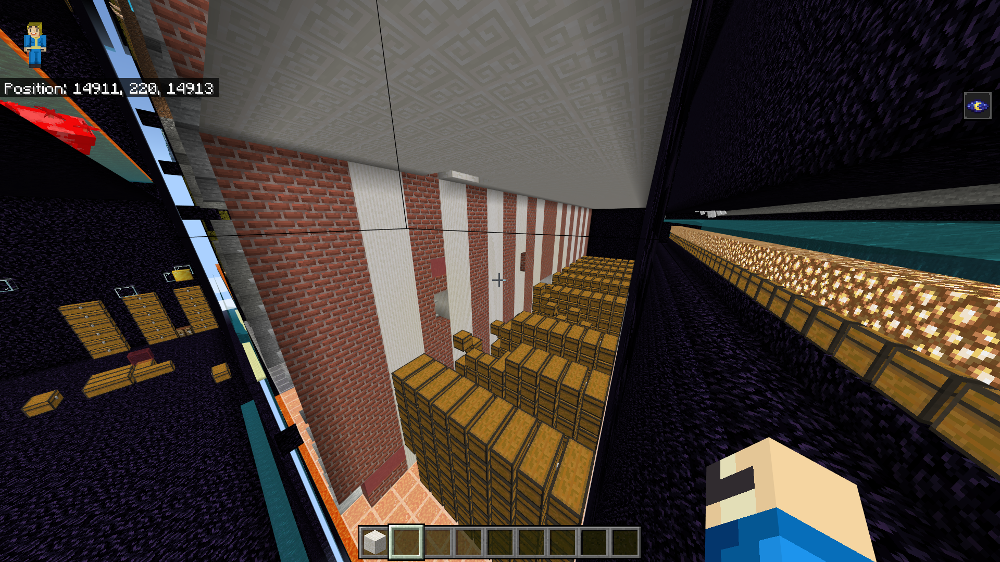

# FasterChest
Speed up world loads and world saves in worlds densely populated with chests.

### What's the Problem?
Survival-like game-servers (including factions and skyblock) generally consist of "team bases" that have
tons of chests. PocketMine follows Mojang's world format which performs terribly on these servers—a change
in one chest requires serializing all chests within the chunk, and 1 chest cannot be read in a chunk
without deserializing all chests in the chunk.
The performance impact that Mojang's default world format has makes it impractical to host survival-like
servers especially when there's a lot of action happening simultaneously (like PvP, events, etc.).


### How FasterChest Works?
FasterChest stores items in chest outside (i.e., separately from) the `worlds` folder in a `chest.db` file
that maps each chest coordinate to their inventory. This means chests are stored individually (rather than
altogether as one serialized entry—which is what Mojang does). This allows chests to be loaded only when
needed (such as when a player accesses the chest, or an explosion drops chest inventory). A chest that hasn't
been accessed during previous and current world-save is neither read nor written.

https://github.com/user-attachments/assets/579b13f9-4f34-43bd-b4c0-79d8b84a11f4

_<p align="center">Vanilla World Load Performance (left) vs. FasterChest Performance (right) for a world consisting of
a chunk with 4096 fully-filled chests containing custom-named items with 5 enchantments</p>_

### How to Use FasterChest?
**A world backup is recommended before using this plugin.**
Install the plugin on your server. All <ins>newly-placed chests</ins> will use a `FasterChest` tile in place of
vanilla chest tiles. This new tile is indistinguishable from chest tiles to players.

**What about existing chests?** Run `/save-all` then `/fasterchest convert <world>` to convert all existing
chests in a  specific world to `FasterChest` tile. This process can take a while depending on how many chunks
(and how many chests) are in your world.

**What if I do not want to use the plugin anymore?** Run `/save-all` then `/fasterchest revert <world>` for all
worlds on your server. This will revert all `FasterChest` tiles to vanilla tiles. Running this command is necessary
if you choose to uninstall the plugin (otherwise you risk corrupting chests in your world).

### When FasterChest Does Not Cut It
Servers that utilize plugins that automatically scan and modify many chests frequently will notice lesser performance
gain from FasterChest. Being strategic with reads and conservative with writes can however help reduce deserialization
or serialization costs (or both!).

### Developer Docs
Programatically convert and revert chest tiles in a world using `Loader::convertWorld()` and `Loader::revertWorld()`
asynchronous methods.
```php
/** @var Loader $loader */
$loader = $this->getServer()->getPluginManager()->getPlugin("FasterChest");
$world = $this->getServer()->getWorldManager()->getDefaultWorld();
Await::f2c(function() use($loader) : Generator{
	$world->saveChunks(); // converters read some tile NBT from disk
	$conversions = yield from $loader->convertWorld($world);
	echo "Converted ", $conversions, " chest(s) to FasterChest";

	$world->saveChunks();
	$reversions = yield from $loader->revertWorld($world);
	echo "Reverted ", $reversions, " chest(s) to vanilla chest";
});
```

`FasterChest` lets you specify a custom serialization mechanism for chest items if you so wish to. Switch from
the default serializer to a custom inventory serializer by creating your own `FasterChestSerializer` instance and
assigning it to `FasterChest::$serializer` during your plugin's `onLoad()`.
```php
FasterChest::$serializer = new MyFasterChestSerializer();
```
